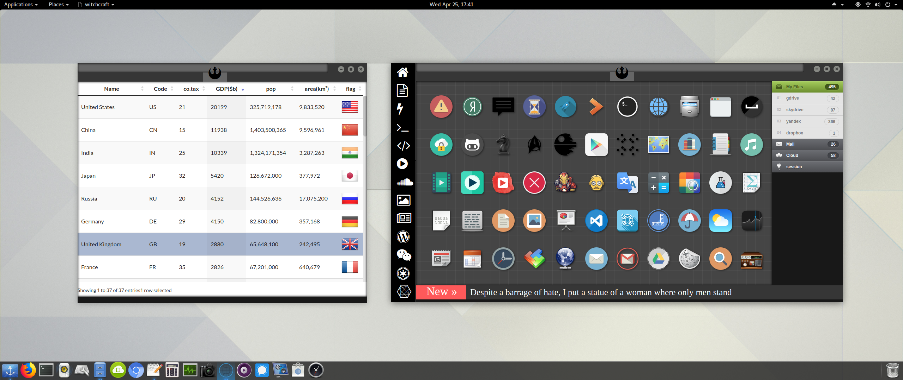

### Markdown
Markdown is a lightweight and easy-to-use syntax for styling your writing. It includes conventions for

```markdown
Syntax highlighted code block

# Header 1
## Header 2
### Header 3

- Bulleted
- List

1. Numbered
2. List

**Bold** and _Italic_ and `Code` text

[Link](url) and 


In html page for pc is easy to implement

<object data="Head_First.pdf#page=514" type="application/pdf" width="100%" height="600px">
    <embed src="Head_First.pdf" type="application/pdf">
        <p>This browser does not support PDFs. Please download the PDF to view it: <a href="Head_First.pdf">Download PDF</a>.</p>
    </embed>
</object>



For more details see [GitHub Flavored Markdown](https://guides.github.com/features/mastering-markdown/).


### Jekyll Themes

Your Pages site will use the layout and styles from the Jekyll theme you have selected in your [repository settings](https://github.com/wiccasoft/wiccasoft.github.io/settings). The name of this theme is saved in the Jekyll `_config.yml` configuration file.

### Support or Contact

[](https://www.youtube.com/embed/bOjSuSVsmrQ)

Having trouble with Pages? Check out our [documentation](https://help.github.com/categories/github-pages-basics/) or [contact support](https://github.com/contact) and we’ll help you sort it out.

{:/}
